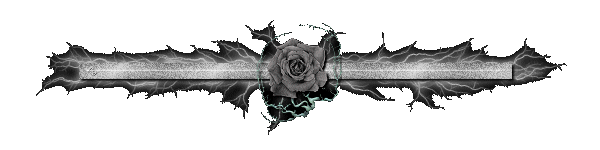

<p align="center">
  
</p>

<h1 align="center">⚡ Loucifer ⚡</h1>

<p align="center">
Cyber Security • Python Developer • Security Research • CTF Player
</p>

<p align="center">
<a href="https://tryhackme.com/p/loucifer">

</a>

<a href="https://github.com/loucifer-x">

</a>


</p>

---

# 💀 About Me

```txt
> Learning offensive security
> Building Python security tools
> Creating Hackopedia
> Active on TryHackMe
> Always learning something new
```


